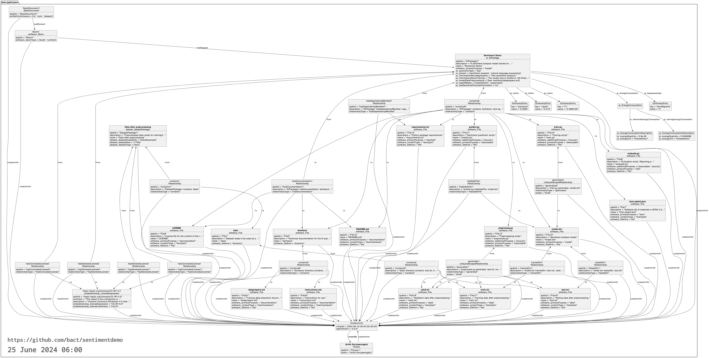

# Sentiment Demo: A Simple AI Application and its AI BOM Example

[](https://doi.org/10.5281/zenodo.14055332)

A simple text classification application, published solely to demonstrate
[a software bill of materials (SBOM)](https://en.wikipedia.org/wiki/Software_supply_chain)
in [SPDX 3.0 format](https://spdx.dev/use/specifications/).

**The main content of the package is its software bill of materials at
[bom.spdx3.json](./bom.spdx3.json).**
Other files are given just to complete the illustration.

*Not recommended for actual text classification tasks.*

SBOM demonstration design goals:

- **Comprehensible:** Small enough for a human to understand easily.
- **Informative:** Elaborate enough to showcase the use of various information fields within an SBOM.
- **Testable:** Designed to facilitate testing and evaluation against specific use case requirements.

*Since May 2025, this AI SBOM example is accepted to the **SPDX Examples** repository,*
*as [ai/example02](https://github.com/spdx/spdx-examples/tree/master/ai/example02).*

For more information about implementing AI BOM using SPDX specification,
see *Karen Bennet, Gopi Krishnan Rajbahadur, Arthit Suriyawongkul, and
Kate Stewart, [“Implementing AI Bill of Materials (AI BOM) with SPDX 3.0: A Comprehensive Guide to Creating AI and
Dataset Bill of Materials”](https://www.linuxfoundation.org/research/ai-bom), The Linux Foundation, October 2024*.

## Content

```text
.
├── LICENSE               License information
├── README.md             This README file
├── bom.spdx3.json        Software bill of materials, in SPDX 3 format
├── data                  Dataset, preprocessed and tokenized
│   ├── test.txt          Testing data
│   ├── train.txt         Training data
│   └── valid.txt         Validation data
├── model.bin             A sentiment analysis model
├── rawdata               Raw dataset, before preprocessing
│   ├── test              Testing data
│   │   ├── neg.txt       Testing samples for label "neg" (negative)
│   │   ├── neu.txt       Testing samples for label "neu" (neutral)
│   │   ├── pos.txt       Testing samples for label "pos" (positive)
│   │   └── q.txt         Testing samples for label "q" (question)
│   ├── train             Training data
│   │   └── ...
│   └── valid             Validation data
│       └── ...
├── requirements.txt      List of required Python libraries
├── src
│   ├── evaluate.py       A script to evaluate prediction performance
│   ├── predict.py        A script to predict a label of a text
│   ├── preprocess.py     A script to prepare training data
│   └── train.py          A script to build a model
└── techdocs              Technical documentation
    ├── dataprepare.md    Data preparation
    └── instructions.md   Instruction for use
```

[](./bom.spdx3.png)

## Usage

See [instruction for use](./techdocs/instructions.md) for how to use the
application.

## Data preparation

See [data preparation](./techdocs/dataprepare.md).

## Notes

- Development is in the `main` branch.
- Will eventually be submitted to
  [spdx/spdx-examples](https://github.com/spdx/spdx-examples) repo.
- The diagram is generated from a PlantUML file:
  [bom.spdx.puml](./bom.spdx3.puml).
  The PlantUML file is generated by
  [spdx3ToGraph](https://github.com/maxhbr/spdx3ToGraph).
  To brevity, spdxIds and long strings are shortened by the
  [shortenid.sh](./tools/shortenid.sh) script in tools/, and all but one
  hyperparameter have been manually removed.
- The energy used by the computer during model training is tracked by
  [energy-tracker](https://github.com/rdegges/energy-tracker).
  It measures how much energy the computer uses during the training.
  This means the actual energy used for training the model might be a bit less
  than the reported amount.
- The SPDX 3.0.1 SBOM is validated structurally against the JSON Schema at
  <https://spdx.org/schema/3.0.1/spdx-json-schema.json>
  and semantically against the SHACL model at
  <https://spdx.org/rdf/3.0.1/spdx-model.ttl>.
- Next steps:
  - Add external dependency relationships
    (e.g. `dependsOn`, `hasProvidedDependency`)
  - Get tested with an SBOM quality check tool like
    [sbomsq](https://github.com/interlynk-io/sbomqs) (once it supports SPDX
    3.0).
  - Using information requirements and obligations in the EU AI Act as a
    target, labeling all relevant properties and relationships with
    corresponding difficulty levels and support levels, based on the
    [BOM Maturity Model](https://scvs.owasp.org/bom-maturity-model/difficulty-levels/).

## Licenses

Apart from the data and components listed in the table below, the code and
content in this repository are dedicated to the public domain under the terms
of Creative Commons Zero ("CC0") 1.0 Universal, which have no copyright and
related or neighboring rights worldwide to the extent allowed by law.

| Component | Name | License | Notes |
| --------- | ---- | ------- | ----- |
| Training data | [Wisesight Sentiment Corpus](https://github.com/PyThaiNLP/wisesight-sentiment) | Creative Commons Zero v1.0 Universal | Samples from the corpus are in `rawdata/`. Preprocessed data is in `data/`. See [data preparation](./techdocs/dataprepare.md) for details. |
| Text preprocessor | [th-simple-preprocessor](https://pypi.org/project/th-simple-preprocessor/) |  Apache License 2.0 | |
| Word tokenizer | [newmm-tokenizer](https://pypi.org/project/newmm-tokenizer/) | Apache License 2.0 | Inherited the license from [PyThaiNLP](https://pypi.org/project/pythainlp/). |
| Text classifier | [fastText](https://pypi.org/project/fasttext/) | MIT License | |
| Array package | [NumPy](https://pypi.org/project/numpy/) | BSD License | |

The specific version information can be found in
[requirements.txt](./requirements.txt).

## Citation

If you use this software, including its software bill of materials (SBOM),
please cite it as follows:

> Suriyawongkul, Arthit. “Sentiment Demo: A Simple AI Application and Its AI BOM Example”. Zenodo, 8 November 2024. <https://doi.org/10.5281/zenodo.14055332>.

BibTeX:

```bibtex
@software{Suriyawongkul_Sentiment_Demo_A_2024,
    author = {Suriyawongkul, Arthit},
    doi = {10.5281/zenodo.14055332},
    license = {CC0-1.0},
    month = nov,
    title = {{Sentiment Demo: A Simple AI Application and its AI BOM Example}},
    url = {https://github.com/bact/sentimentdemo/},
    version = {0.1},
    year = {2024}
}
```
